# Introduction

Progression-free survival (PFS) is a key clinical endpoint in breast cancer research, defined as the time from diagnosis to disease progression or death. In this report, we build a prediction model for log-transformed PFS using data from 2,000 breast cancer patients diagnosed between 1990 and 1995 (Part I), and evaluate whether this model generalizes to a separate cohort of 2,000 patients diagnosed between 2000 and 2005 (Part II).

We consider four candidate models that span a range of complexity: **elastic net** as a regularized linear baseline with built-in variable selection; **PLS** as a dimension-reduction approach suited to correlated predictors; **MARS** for automatically capturing nonlinearity and interactions while maintaining interpretable piecewise-linear structure; and **GAM** for flexible nonparametric smoothing of continuous predictors. This set covers the spectrum from linear to nonlinear methods, allowing us to assess whether additional model flexibility translates into meaningful predictive gains.

# Part I: Prediction Model for PFS (1990--1995 Cohort)

## Data Overview

The dataset (datA) contains 2,000 patients with complete follow-up and no missing values. The response variable is log-transformed PFS (months). There are 15 predictors: five continuous (age, BMI, tumor size, number of positive lymph nodes, Ki-67 index) and ten categorical (menopausal status, race, tumor grade, ER/PR/HER2 status, clinical stage, surgery type, chemotherapy, and hormonal therapy). Table 1 summarizes the sample characteristics. Exploratory analysis revealed that log(PFS) is approximately normally distributed (Figure 1). Among continuous predictors, tumor size and lymph node count show negative associations with log(PFS), while correlations among predictors are generally low (Figures 2--3). Boxplots indicate that ER-positive status, lower tumor grade, and earlier clinical stage are associated with longer PFS (Figure 4).

## Model Training

The data were randomly split into a training set (80\%, $n = 1600$) and a held-out test set (20\%, $n = 400$) using stratified sampling on `log_PFS` via `createDataPartition`. A single random seed (8106) was set at the beginning of the analysis for all subsequent random operations. All analyses were conducted in R (version 4.5). Elastic net, PLS, and MARS were trained using the `caret` package with `glmnet`, `pls`, and `earth` as backends. GAM was fitted directly via `mgcv::gam()` with manual cross-validation using the same fold indices, as `caret`'s GAM wrapper does not properly handle categorical predictors (it applies smooth terms to dummy variables). Categorical predictors were converted to factors and expanded into dummy indicators via treatment coding. All models were evaluated using 10-fold CV on the training set with pre-specified fold indices (generated by `createFolds` with seed 8106) to ensure a fair comparison. For the three caret-based models, we applied two hyperparameter selection strategies: "best" (minimizing CV RMSE) and "1SE" (the simplest model within one standard error of the minimum), enabling a systematic assessment of the parsimony--performance trade-off. After identifying the best hyperparameters under each rule, final models were refit on the full training set and evaluated on the held-out test set.

**Elastic net** was tuned in two steps: first, the optimal mixing parameter $\alpha$ was identified via CV over a full grid of $\alpha \in \{0, 0.1, \ldots, 1\}$ and $\lambda$ over 100 values equally spaced on the log scale from $e^{-6}$ to $e^{2}$; then, the 1SE rule was applied along the $\lambda$ path with $\alpha$ fixed at the best value, ensuring that the 1SE model is a sparser version of the same model type. No additional centering or scaling was applied, as `glmnet` standardizes internally.

**PLS** was tuned over 1--15 components. Predictors were centered and scaled within each CV fold via `preProcess`.

**MARS** was tuned over interaction degree $\in \{1, 2, 3\}$ and the maximum number of retained terms (nprune) $\in \{2, \ldots, 18\}$, with internal generalized cross-validation (GCV) used for basis function pruning.

**GAM** was fitted with thin-plate regression splines (`s()`) on all five continuous predictors (age, BMI, tumor size, lymph nodes, Ki-67) and parametric (linear) terms for the ten categorical predictors. Smoothing parameters were estimated by restricted maximum likelihood (REML). Since GAM is not trained via `caret`, the 1SE rule does not apply; only one version is reported.

## Results

Table 2 reports the CV RMSE, test RMSE, and number of predictors used for each model under both selection rules. All four models achieved similar test RMSE (within 2\%), suggesting that additional model flexibility provides negligible predictive gain on unseen data. The modest CV $R^2$ (approximately 0.20) indicates that the available predictors explain a limited proportion of PFS variability, which is common in clinical prediction settings with heterogeneous patient populations.

**Final model selection.** We select MARS (best) as the final model. Although GAM achieved the lowest test RMSE, the difference from MARS is less than 1\%, while MARS uses only 6 predictors compared to GAM's 15. The 1SE version of MARS further reduces to 4 predictors with only a modest increase in test RMSE, confirming that a parsimonious MARS model retains strong predictive performance. MARS produces a fully transparent piecewise-linear model that can be written as an explicit equation and communicated to clinicians. By contrast, GAM's smooth functions cannot be easily summarized in closed form, PLS offers no variable selection despite using all predictors in a single latent component, and the elastic net assumes strictly linear effects.

**Model interpretation.** The selected MARS model is additive (degree 1, no interactions) with 9 basis functions involving 6 predictors out of 15 (Table 4). The model reveals how demographic, tumor, and treatment characteristics influence PFS:

- *Lymph nodes* (most important): for patients with fewer than 8 positive nodes, each additional node decreases log(PFS) by 0.075. Beyond 8 nodes, the effect plateaus---consistent with extensive nodal involvement already indicating advanced disease.
- *ER status*: ER-positive patients have 0.250 higher log(PFS) than ER-negative, reflecting the favorable prognosis associated with hormone receptor positivity.
- *HER2 status*: HER2-positive patients have 0.161 lower log(PFS), consistent with the more aggressive biology of HER2-positive tumors in the 1990s (before targeted therapies).
- *Hormonal therapy*: receipt of hormonal therapy increases log(PFS) by 0.144, reflecting its protective effect.
- *BMI*: a V-shaped relationship with a knot at 24.7 kg/m$^2$---both lower and higher BMI are associated with shorter PFS, with a steeper decline below 24.7 (--0.048 per unit) than above (--0.028 per unit).
- *Tumor size*: for tumors smaller than 5.3 cm, each cm increase decreases log(PFS) by 0.056; beyond 5.3 cm, the effect levels off.
- *Ki-67*: above 24.5\%, each percentage point increase decreases log(PFS) by 0.010, reflecting higher proliferative activity.

Notably, the model excludes age, race, PR status, clinical stage, surgery type, and chemotherapy---suggesting that after accounting for the above factors, these variables do not contribute additional predictive information. Variable importance rankings (Figure 5) and partial dependence plots (Figure 6) further illustrate these relationships. GAM smooth functions (Figure 7) corroborate the nonlinear patterns identified by MARS. Elastic net coefficients (Table 3) provide a complementary linear perspective, identifying a similar set of key predictors. Residual diagnostics on both training and test sets (Figure 8) show no major departures from model assumptions.

# Part II: Generalization to the 2000--2005 Cohort

## Evaluating Model A on Data B

We applied all four models trained on the datA training set to the full datB dataset. As shown in Table 5, RMSE increased substantially compared to the test set performance on datA, representing a relative increase of roughly 20\%. The observed-versus-predicted plot (Figure 9) reveals systematic underprediction for patients with longer PFS, and the residual distribution (Figure 10) is shifted positively (mean residual $> 0$), indicating that patients in the later cohort tend to have longer PFS than predicted by the 1990s model. These results demonstrate that the prediction model does not generalize well to the 2000--2005 cohort.

## Understanding the Distributional Shift

Comparing the two cohorts (Table 6, Figures 11--12), log(PFS) in cohort B has a higher mean, reflecting improvements in breast cancer treatment over the decade. Treatment patterns also shifted---notably increased hormonal therapy use---and the distributions of clinical stage and other variables changed. These temporal shifts explain the poor transportability.

## New Model for the 2000--2005 Cohort

We retrained all four models on datB using the same methodology: an 80/20 train-test split ($n_{\text{train}} = 1600$, $n_{\text{test}} = 400$), 10-fold CV with both best and 1SE selection rules, and test set evaluation (Table 7). We select MARS (1SE) as the final model for cohort B: it uses only 6 predictors and achieves a test RMSE competitive with models that use all 15 predictors. Notably, MARS (1SE) achieves a lower test RMSE than MARS (best), indicating that the 1SE rule's additional regularization improves generalization. Comparing the MARS coefficients between cohorts (Tables 4 and 8) and the elastic net coefficients (Table 9), we observe the following key differences:

1. **Hormonal therapy**: Its MARS coefficient increased from +0.144 (cohort A) to +0.205 (cohort B), likely reflecting increasing efficacy of targeted hormonal therapies (e.g., aromatase inhibitors) in the 2000s.

2. **HER2 status**: HER2 was a significant negative predictor in cohort A (MARS: --0.161; elastic net: --0.122) but was excluded from the cohort B MARS model entirely, and its elastic net coefficient shrank to near zero (+0.017). This aligns with the introduction of trastuzumab (Herceptin) around 2000.

3. **Variable importance shift**: Lymph nodes was the top predictor in cohort A; in cohort B, the relative importance of predictors shifted (Figure 13). Tumor grade emerged as a new MARS term in cohort B, and a race effect (race 4) appeared.

In conclusion, the 1990--1995 model does not generalize well to the 2000--2005 cohort. The changes---enhanced role of hormonal therapy and diminished HER2 impact---reflect genuine shifts in breast cancer treatment. A cohort-specific model is necessary for the later population.

\newpage

# Appendix: Figures and Tables

```{r setup, include=FALSE}
knitr::opts_chunk$set(echo = FALSE, warning = FALSE, message = FALSE,
                      fig.pos = "H", out.extra = "")
library(tidyverse); library(caret); library(glmnet); library(earth)
library(mgcv); library(pls); library(pdp); library(vip)
library(corrplot); library(knitr); library(gridExtra); library(kableExtra)

load("models.RData")
```

## Tables

```{r tab1}
cont_sum <- A %>% select(age, bmi, tumor_size, lymph_nodes, Ki67, log_PFS) %>%
  pivot_longer(everything(), names_to="Variable", values_to="Value") %>%
  group_by(Variable) %>%
  summarise(Summary = paste0(round(mean(Value),2), " (", round(sd(Value),2), ")"))

cat_sum <- A %>% select(all_of(cat_vars)) %>%
  pivot_longer(everything(), names_to="Variable", values_to="Level") %>%
  count(Variable, Level) %>% group_by(Variable) %>%
  mutate(Summary = paste0(Level, ": ", n, " (", round(100*n/sum(n),1), "%)")) %>%
  summarise(Summary = paste(Summary, collapse = "; "))

tab1 <- bind_rows(cont_sum, cat_sum) %>% select(Variable, Summary)
kable(tab1, caption="Sample characteristics (datA, n = 2000). Continuous variables reported as Mean (SD); categorical variables as Level: n (\\%).",
      format = "latex", booktabs = TRUE) %>%
  kable_styling(latex_options = "hold_position", font_size = 9) %>%
  column_spec(1, width = "3.5cm") %>%
  column_spec(2, width = "12cm") %>%
  pack_rows("Continuous", 1, nrow(cont_sum)) %>%
  pack_rows("Categorical", nrow(cont_sum)+1, nrow(cont_sum)+nrow(cat_sum))
```

```{r tab2}
kable(comparison_table, row.names=FALSE,
      caption="Model performance with best and 1SE selection rules (datA, training n = 1600, test n = 400).")
```

```{r tab3}
coef_enet <- coef(enet_fit$finalModel, s=enet_fit$bestTune$lambda)
coef_df <- data.frame(Variable=rownames(coef_enet), Coefficient=round(as.numeric(coef_enet),4)) %>%
  filter(Coefficient!=0) %>% arrange(desc(abs(Coefficient)))
kable(coef_df, row.names=FALSE, caption="Non-zero elastic net coefficients (datA).")
```

```{r tab4}
mars_coef <- data.frame(Term=names(coef(mars_fit$finalModel)),
                        Coefficient=round(as.numeric(coef(mars_fit$finalModel)),4))
kable(mars_coef, row.names=FALSE, caption="MARS (best) basis function coefficients (datA).")
```

```{r tab5}
kable(gen_table, row.names=FALSE, caption="Generalization performance: Model A test RMSE vs. RMSE on datB.")
```

```{r tab6}
comp_A <- A %>% select(age,bmi,tumor_size,lymph_nodes,Ki67,log_PFS) %>%
  summarise(across(everything(), ~paste0(round(mean(.x),2)," (",round(sd(.x),2),")"))) %>%
  pivot_longer(everything(), names_to="Variable", values_to="Cohort A (1990-1995)")
comp_B <- B %>% select(age,bmi,tumor_size,lymph_nodes,Ki67,log_PFS) %>%
  summarise(across(everything(), ~paste0(round(mean(.x),2)," (",round(sd(.x),2),")"))) %>%
  pivot_longer(everything(), names_to="Variable", values_to="Cohort B (2000-2005)")
kable(left_join(comp_A, comp_B, by="Variable"),
      caption="Mean (SD) comparison of continuous variables between cohorts.")
```

```{r tab7}
kable(comp_B_table, row.names=FALSE,
      caption="Model performance with best and 1SE selection rules (datB, training n = 1600, test n = 400).")
```

```{r tab8}
mars_coef_B <- data.frame(Term=names(coef(mars_fit_B_1se$finalModel)),
                          Coefficient=round(as.numeric(coef(mars_fit_B_1se$finalModel)),4))
kable(mars_coef_B, row.names=FALSE, caption="MARS (1SE) basis function coefficients (datB).")
```

```{r tab9}
coef_A_enet <- coef(enet_fit$finalModel, s=enet_fit$bestTune$lambda)
coef_B_enet <- coef(enet_fit_B$finalModel, s=enet_fit_B$bestTune$lambda)
coef_comp <- data.frame(Variable=rownames(coef_A_enet),
                        Cohort_A=round(as.numeric(coef_A_enet),4),
                        Cohort_B=round(as.numeric(coef_B_enet),4)) %>%
  mutate(Change=round(Cohort_B-Cohort_A,4)) %>%
  filter(Cohort_A!=0|Cohort_B!=0) %>% arrange(desc(abs(Change)))
kable(coef_comp, row.names=FALSE, caption="Elastic net coefficient comparison between cohorts.")
```

\newpage

## Figures

```{r fig1, fig.cap="Distribution of log-transformed PFS (datA).", out.width="100%"}
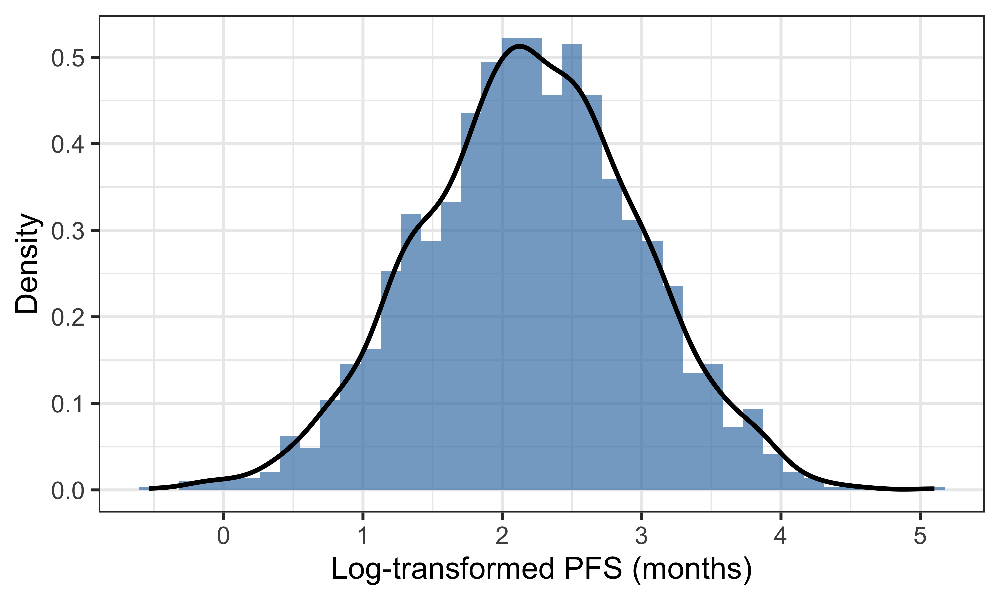
```

```{r fig2, fig.cap="Scatter plots of continuous predictors vs. log\\_PFS.", out.width="100%"}
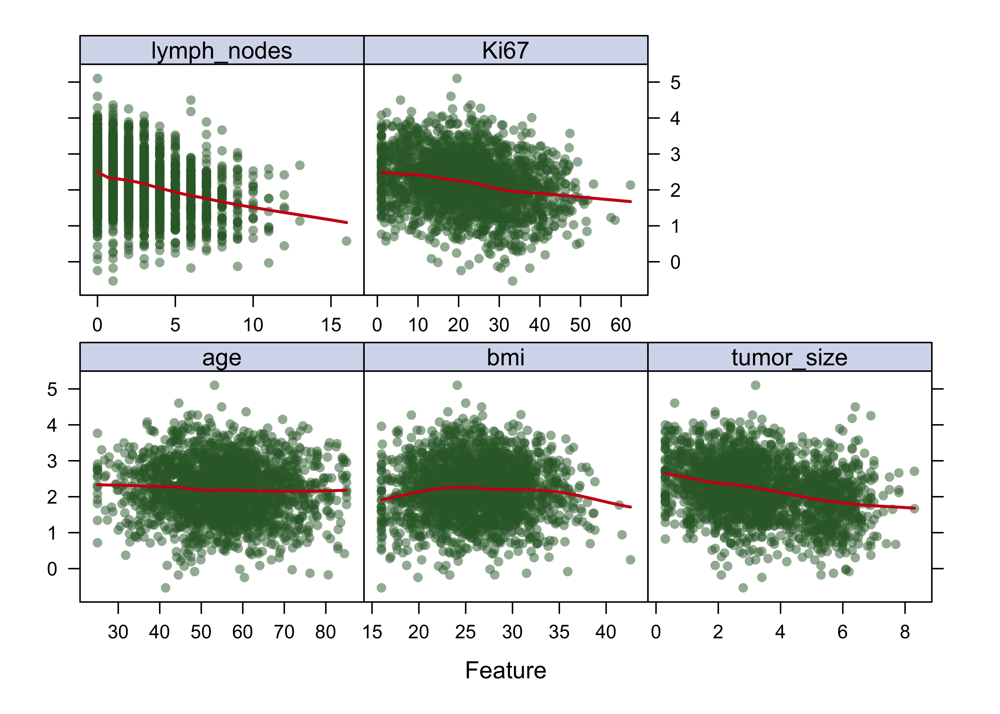
```

```{r fig3, fig.cap="Correlation matrix of continuous variables.", out.width="80%"}
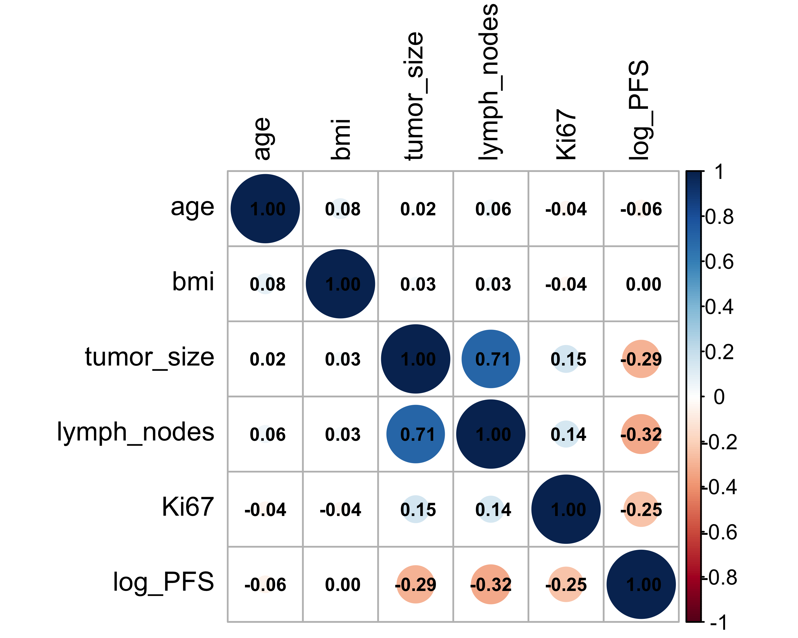
```

```{r fig4, fig.cap="Boxplots of log\\_PFS by categorical predictors.", out.width="100%"}
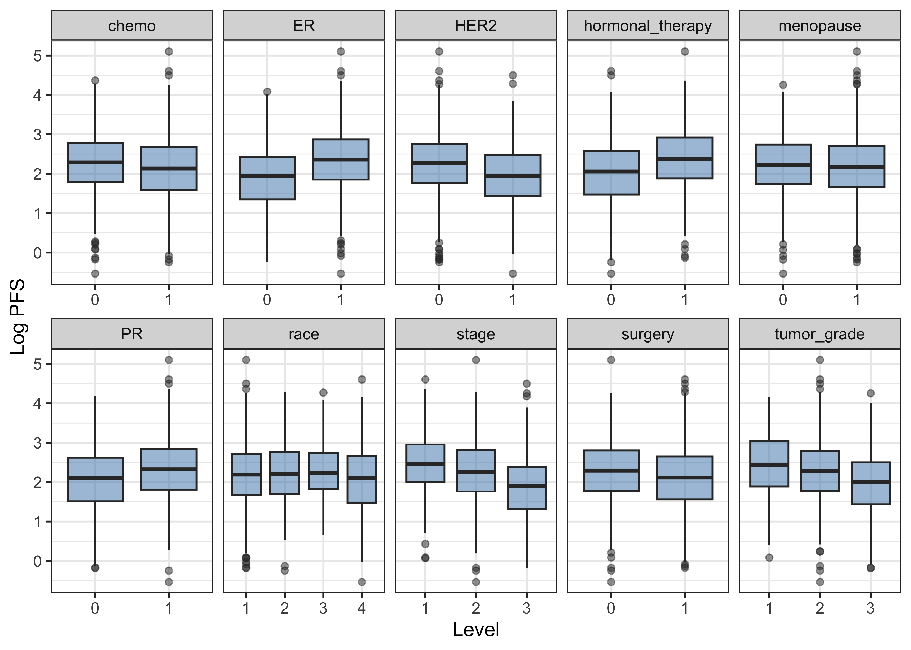
```

```{r fig5, fig.cap="Variable importance from MARS, Lasso, and PLS (datA).", out.width="100%"}
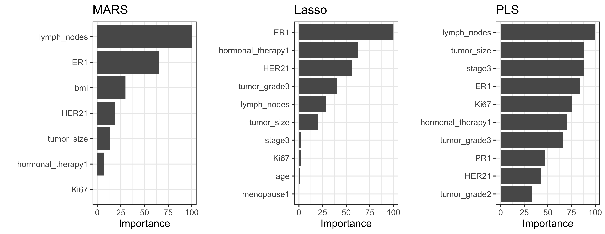
```

```{r fig6, fig.cap="Partial dependence plots for top 6 predictors (MARS, datA).", out.width="100%"}
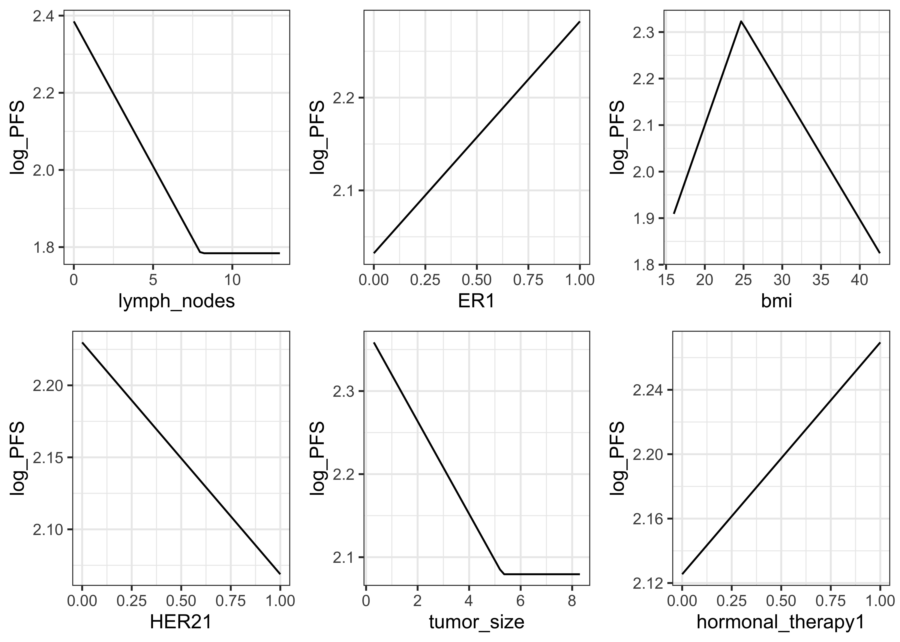
```

```{r fig7, fig.cap="GAM smooth function estimates (datA).", out.width="100%"}
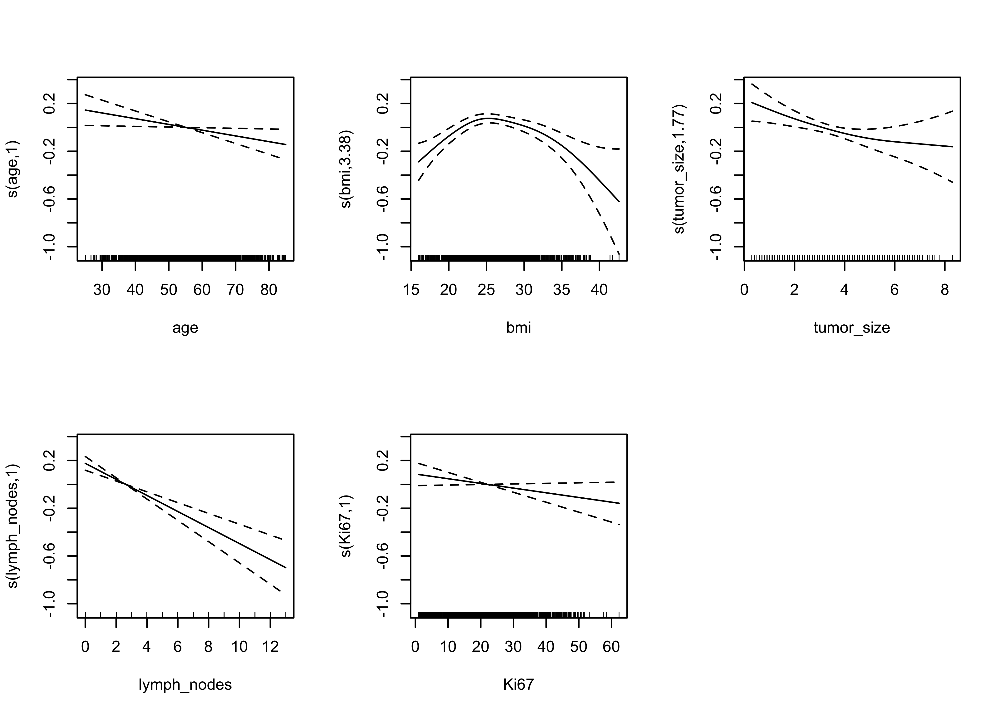
```

```{r fig8, fig.cap="Residual diagnostics for MARS on training (top) and test (bottom) data.", out.width="100%"}
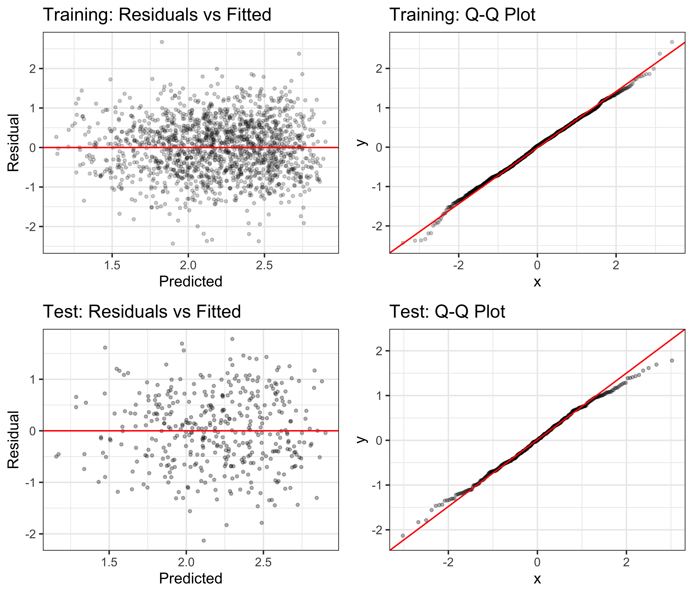
```

```{r fig9, fig.cap="Observed vs. predicted log\\_PFS on datB (MARS from cohort A).", out.width="80%"}
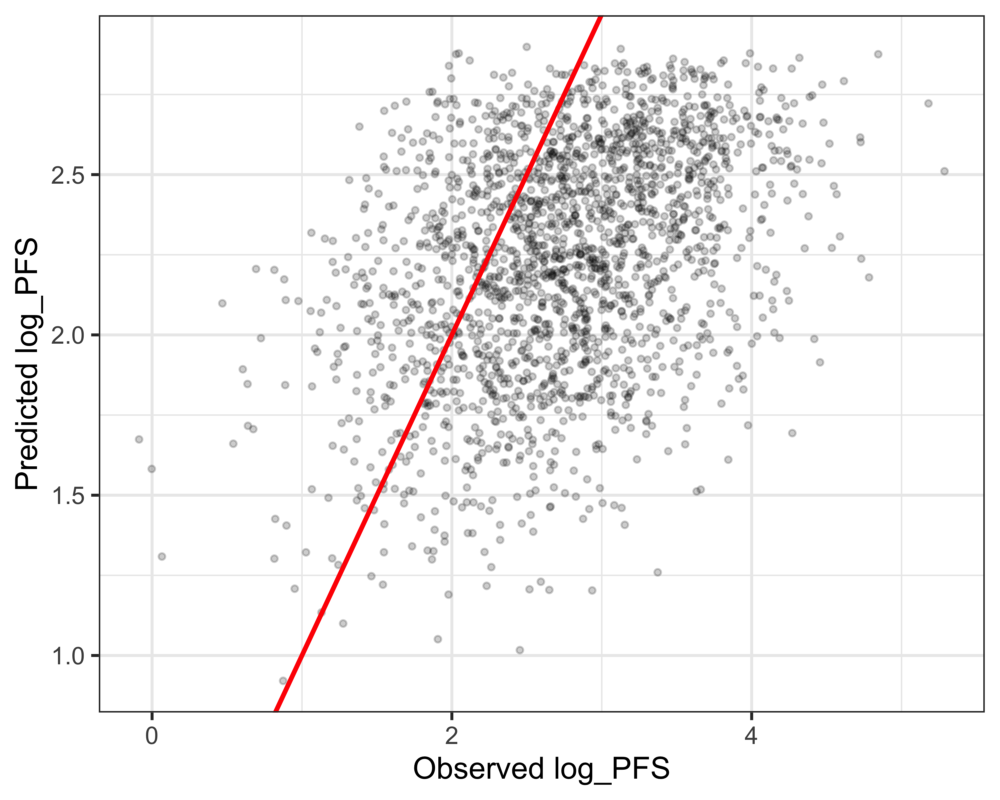
```

```{r fig10, fig.cap="Residual comparison: MARS on test set A vs. full datB.", out.width="100%"}
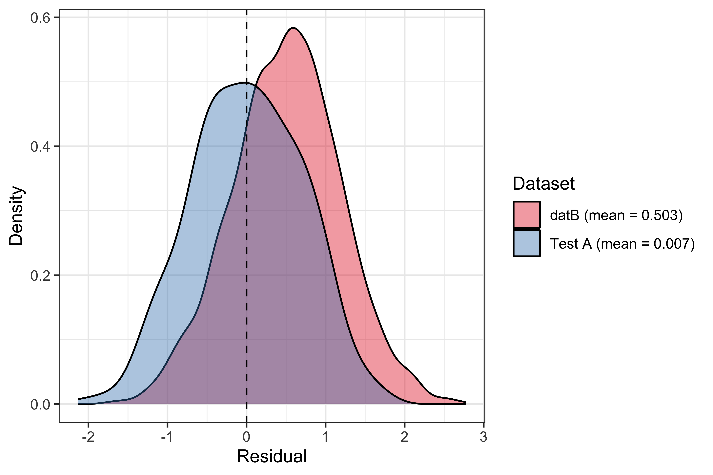
```

```{r fig11, fig.cap="Distribution comparison of continuous variables between cohorts.", out.width="100%"}
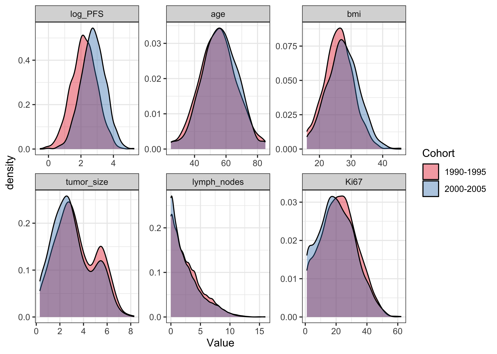
```

```{r fig12, fig.cap="Categorical variable distributions across cohorts.", out.width="100%"}
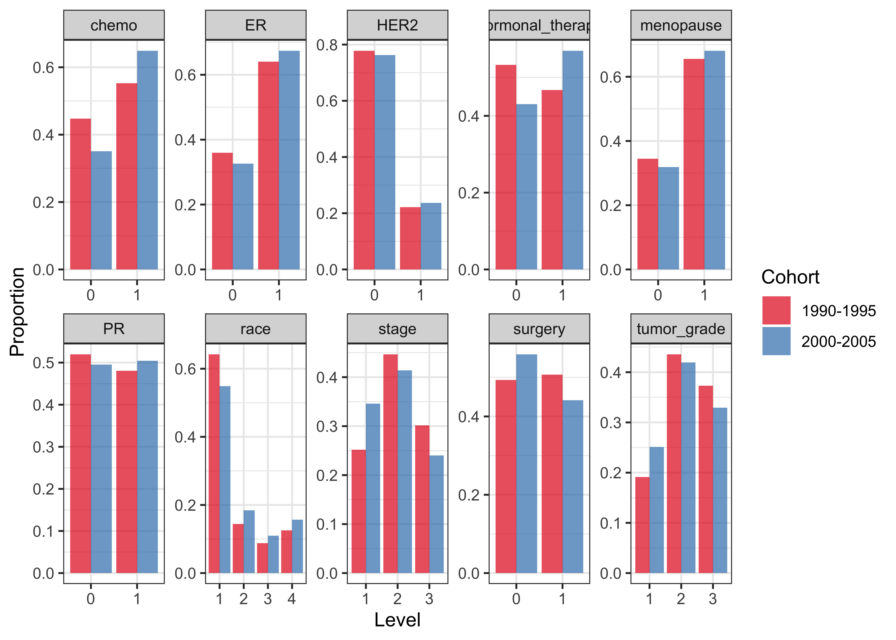
```

```{r fig13, fig.cap="Variable importance comparison (MARS) between cohorts.", out.width="100%"}
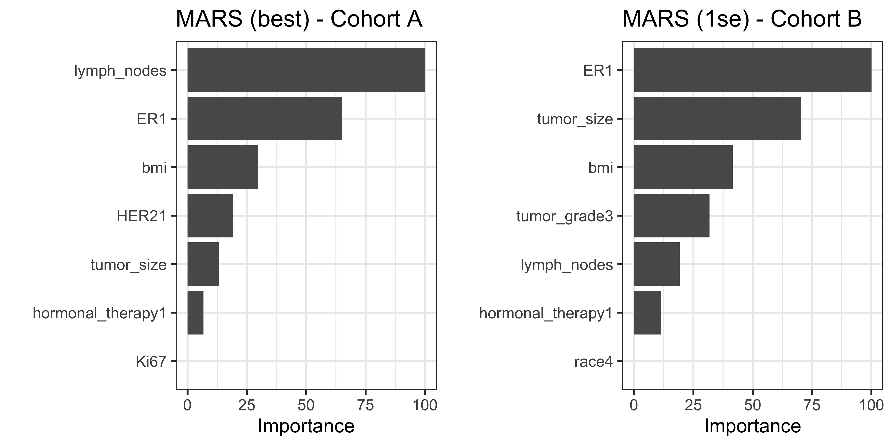
```
